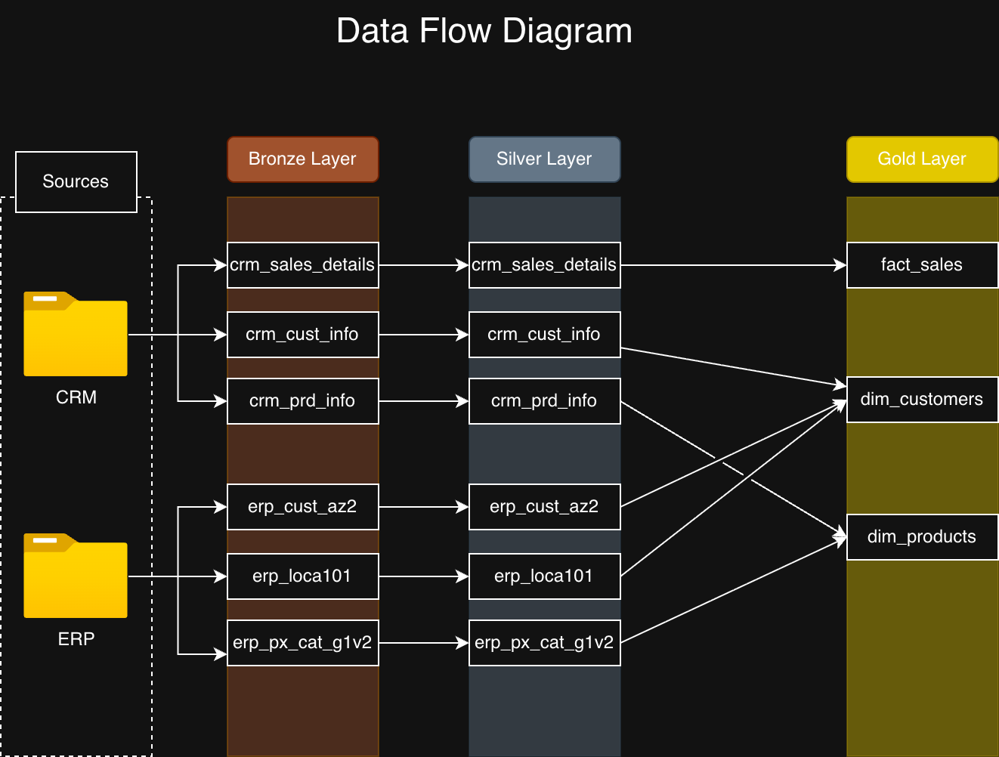
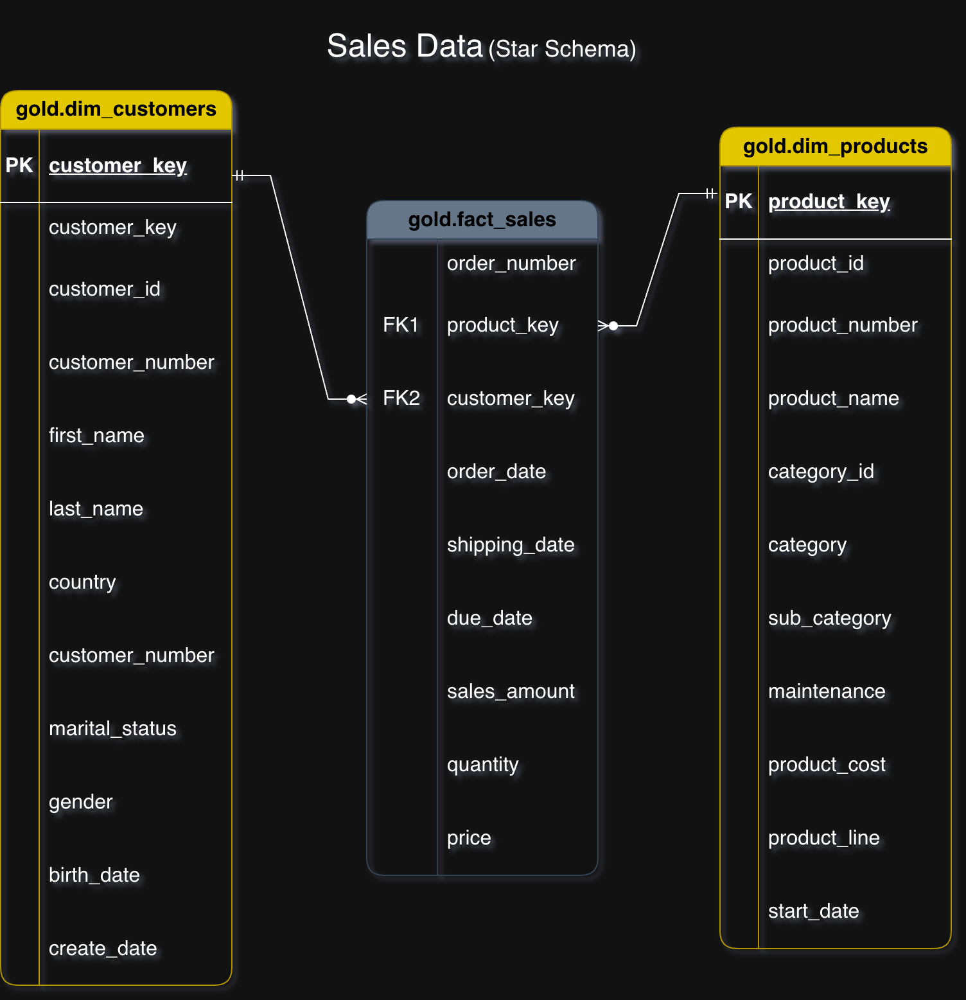

# Project Overview

Project Overview

Welcome! This project was the first end-to-end implementation of a modern data warehouse, completed as part of this course. Focus was placed on setting up a robust, scalable system that covers everything from raw data ingestion right through to final reports.

Here's a breakdown of the core technical areas implemented:

### 1. Data Architecture: Medallion Framework

The entire warehouse was designed around the Medallion Architecture. This was crucial for ensuring data quality and organization. The flow is structured into three distinct layers:

Bronze: This is the initial landing zone where data is kept raw, exactly as it comes from the source systems.

Silver: Here, the raw data is cleaned, standardized, and de-duplicated. It represents a single source of truth for all enterprise data.

Gold: The final layer! This contains highly refined, aggregated, and optimized data ready for reporting and business intelligence (BI) tools.

### 2. ETL Pipelines & Workflows

Extract, Transform, Load (ETL) pipelines were built to manage the data movement. This involved writing the logic to:

Extract data from the various source systems.

Transform it—this was the core work of cleaning, normalizing, and shaping the data based on business rules.

Load the processed data sequentially into the Silver and Gold layers.

### 3. Data Modeling

To support analytical speed and clarity, a Dimensional Model focused on optimization was implemented. This involved developing and populating:

Fact Tables: Holding quantitative, observable events (like sales transactions or measurements).

Dimension Tables: Holding descriptive attributes related to the facts (like customer names, dates, or product details).

### 4. Analytics & Reporting

The goal was to make the data actionable! Several key outputs were created and validated:

Specific SQL-based reports were written against the Gold layer to extract key business metrics.

The Gold tables were structured perfectly to feed BI dashboards, providing actionable insights to end-users.

# Key Technologies and Tools

This project utilized several foundational technologies for database hosting, development, containerization, and visual documentation.

### Database Engine & Language

**Microsoft SQL Server (T-SQL):** The robust relational database management system chosen to host all the warehouse layers (Bronze, Silver, and Gold). T-SQL was the primary language used for developing all ETL stored procedures, executing data validation rules, defining transformations, and generating the final analytical queries for reporting.

### Development Environment & Containerization

 **Docker:** Employed for consistency and portability. Docker was used to containerize the SQL Server instance, ensuring the entire database environment is isolated, easily reproducible, and runnable across different operating systems without dependency issues.

**VS Code** (Visual Studio Code): Served as the main development environment. It was used for writing and managing all SQL scripts, editing project configuration files, and streamlining the overall development workflow.

### Visuals and Documentation

**Draw.io (Diagrams.net):** A key tool for documentation. It was used extensively to create and visualize the data architecture diagrams (demonstrating the Medallion flow) and the dimensional models, ensuring clear structural documentation of the system.

# Author & Contact
#### Name : Aghiad Daghestani
#### Email: aghiad.daghestani97@gmail.com
#### LinkedIn: https://www.linkedin.com/in/aghiad-daghestani-54617b261/
#### Github: https://github.com/Aghiad97
